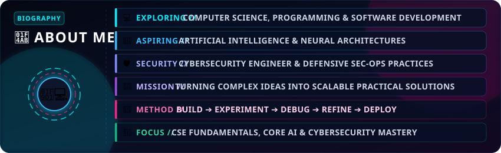
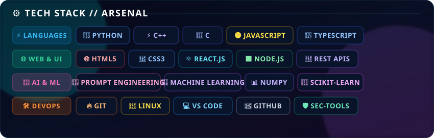
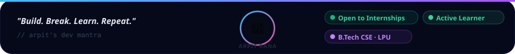

  

 

  

 

 

 

 

  
  &nbsp;&nbsp;
  

  

 

 

  
    Redesigned with handcrafted <strong>SVG animations</strong> — no static images, no 2D flatness. 
    Made with love by <strong>Arpit Rana</strong> · 2025
  

