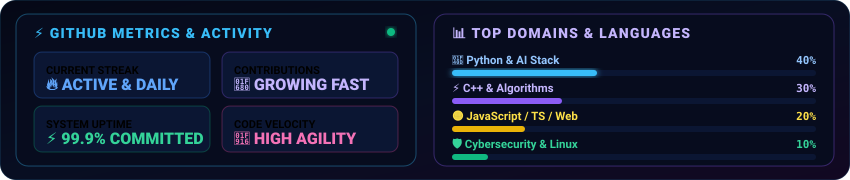

  

 

  

 

  

 

  

 

  

 

  

 

  

 

  
    ⚡ Designed with handcrafted <strong>pure animated SVG graphics</strong> — no static images, no 2D flatness. 
    Built with 💙 by <strong>Arpit Rana</strong>
  

